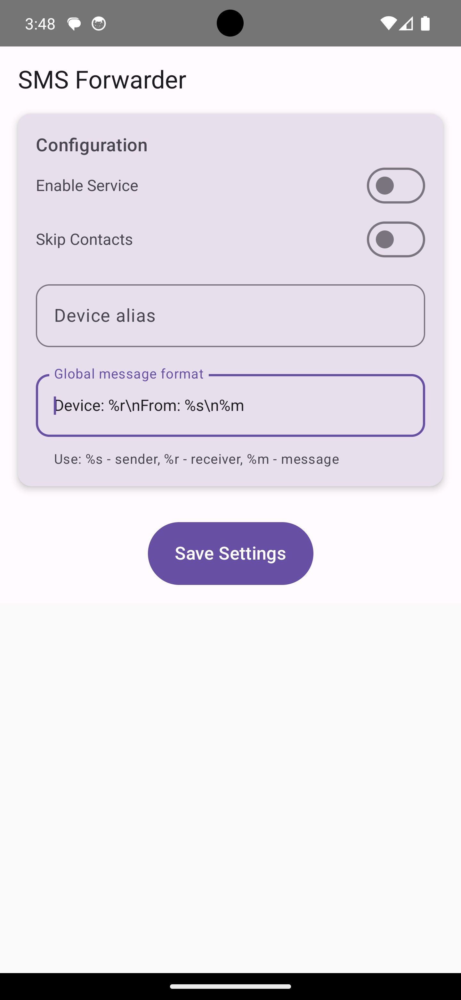
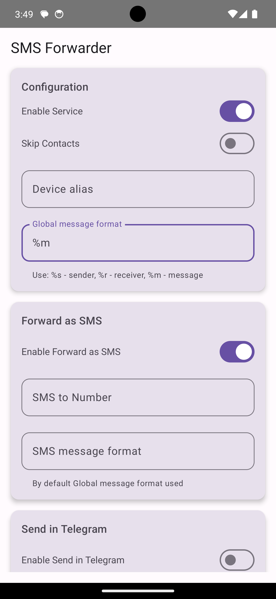

# SMS Forwarder

A simple Android application that forwards received SMS messages to a specified number and/or a Telegram channel. The app allows users to configure their preferences for SMS and Telegram services.

## Features

- Enable or disable SMS forwarding.
- Specify the phone number to forward SMS messages.
- Integrate with Telegram to send received messages to a specified user.
- User-friendly settings interface built with Jetpack Compose.

## Screenshots

| Screenshot 1 | Screenshot 2 | Screenshot 3 |
|---------------|---------------|---------------|
|  |  |  |

## Requirements

- Android 5.0 (API level 21) or higher.
- Permissions for sending and receiving SMS, as well as reading contacts.

## Installation

1. Clone the repository:
   ```bash
   git clone https://github.com/viswanathantj/sms-forwarder.git
   ```
2. Open the project in Android Studio.
3. Sync the Gradle files.
4. Run the application on your Android device or emulator.

## Permissions

This app requires the following permissions:
- `SEND_SMS`: To send SMS messages.
- `RECEIVE_SMS`: To receive SMS messages.
- `READ_SMS`: To read incoming SMS messages.
- `READ_CONTACTS`: To access contact information (optional).
- `INTERNET`: To send messages via Telegram.

Make sure to grant these permissions when prompted.

## Usage

1. Open the app and configure your SMS forwarding settings.
2. Enable the SMS service and enter the phone number to which you want to forward SMS messages.
3. (Optional) Enable the Telegram service and enter your Telegram API key and user IDs.
4. Save your settings.

## Troubleshooting

- If the app crashes on receiving SMS, check your permissions in the app settings.
- Ensure the number entered for SMS forwarding is valid.
- If you do not receive forwarded messages, check your Telegram settings and API key.

## Contributing

Contributions are welcome! If you have suggestions for improvements or features, please open an issue or submit a pull request.

## Acknowledgments

- Jetpack Compose for modern UI development.
- Telegram Bot API for message forwarding.
